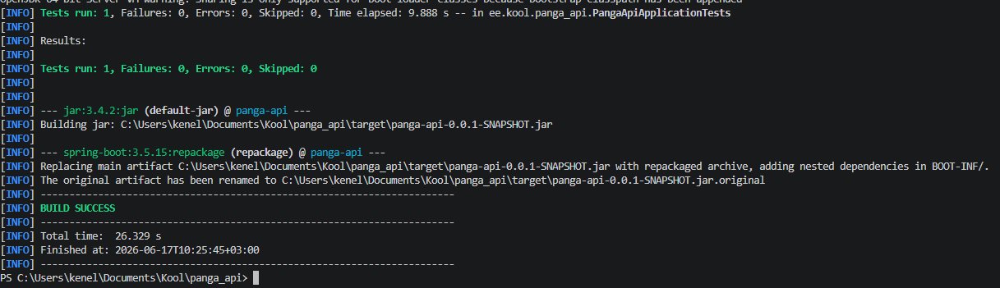

# AI kvaliteediplaan

## Valitud AI reeglite fail

Valisin projekti AI reeglite failiks `AGENTS.md`, sest see on mõeldud arendusagentidele projektipõhiste juhiste andmiseks. Fail asub projekti juurkaustas, et AI tööriist leiaks selle kohe projekti avamisel.

`AGENTS.md` sobib selle projekti jaoks hästi, sest sinna saab kirja panna projekti struktuuri, arenduskäsud, testimise reeglid, turvanõuded, Git töövoo ja piirangud, mida AI peab koodi muutmisel järgima.

## Kasutatud allikad

Kasutasin järgmisi allikaid:

1. OpenAI Developers – Custom instructions with AGENTS.md.
2. agents.md – AGENTS.md formaadi kirjeldus.
3. GitHub Docs – GitHub Copiloti custom instructions ja toetatud juhisefailid.
4. GitHub Docs – Branch protection ja required status checks.
5. GitHub Docs – Pull request’id ja protected branches.

Nendest allikatest sain infot selle kohta, kuidas AI arendusassistendile projektipõhiseid juhiseid anda ning kuidas kaitsta `main` haru katkise või kontrollimata koodi eest.

## Projekti suurimad riskid AI-ga arendamisel

Selle projekti puhul on kõige suuremad riskid seotud töötava funktsionaalsuse rikkumisega. Rakendus tegeleb kasutajate, kontode, ülekannete, autentimise ja andmebaasiga. Kui AI muudab mõnda nendest osadest liiga hooletult, võib rakendus küll kompileeruda, aga äriloogika võib valesti tööle hakata.

Peamised riskid on:

* AI muudab olemasolevaid API endpoint’e ja Swaggeri kaudu testitavad päringud ei tööta enam.
* AI muudab konto loomise või kontonumbri genereerimise loogikat.
* AI rikub ülekannete äriloogikat, näiteks saldo kontrolli.
* AI eemaldab või nõrgendab API võtmega autentimist.
* AI muudab entity klasse nii, et andmebaasiga tekib probleem.
* AI lisab uusi dependency’sid ilma vajaduseta.
* AI teeb liiga suure muudatuse korraga ja seda on raske kontrollida.

## Kuidas reeglid aitavad katkist koodi vältida

`AGENTS.md` failis olevad reeglid sunnivad AI-d enne muudatuste tegemist projekti olemasolevat struktuuri arvestama. AI ei tohi muuta avalikke API route’e, andmebaasi välju, autentimist ega olulist äriloogikat ilma selge vajaduseta.

Failis on kirjas, et AI peab hoidma muudatused väiksed ja keskenduma ainult ülesandega seotud failidele. See vähendab riski, et AI parandab ühte asja, aga rikub samal ajal kõrvalise osa.

Samuti on reeglites kirjas, et enne töö lõpetamist tuleb käivitada testid ja vajadusel ka build. Kui testid või build ebaõnnestuvad, ei tohi tööd valmis märkida.

## Kuidas vältida katkise koodi jõudmist main harusse

Ainult `AGENTS.md` fail ei kaitse `main` haru tehniliselt. See fail annab AI-le juhised, kuid tegelik kaitse peab tulema GitHubi töövoost.

Selleks peaks projektis kasutama järgmisi võtteid:

* iga muudatus tehakse eraldi feature branch’is;
* `main` harusse ei push’ita otse;
* muudatus viiakse `main` harusse pull request’i kaudu;
* pull request peab olema väike ja arusaadav;
* enne merge’imist peavad testid ja build õnnestuma;
* võimalusel kasutatakse GitHub Actions CI workflow’d;
* `main` harule võiks seadistada branch protection’i.

Selline töövoog aitab vältida olukorda, kus AI või arendaja saadab katkise koodi otse põhilisse harusse.

## Käsud, mis peavad enne töö lõpetamist õnnestuma

Selles projektis on kõige olulisemad Maven käsud.

Testide käivitamine:

```bash
mvn test
```

Projekti build:

```bash
mvn package
```

Rakenduse käivitamine arenduse ajal:

```bash
mvn spring-boot:run
```

Kui muudetakse ainult dokumentatsiooni, ei ole täielik build alati kohustuslik. Kui aga muudetakse Java koodi, `pom.xml` faili, entity klasse, konfiguratsiooni või turvalisust, tuleb käivitada vähemalt `mvn test` ja soovitatavalt ka `mvn clean package`.

## Regressioonide vältimine

Regressioon tähendab olukorda, kus varem töötanud funktsionaalsus läheb pärast muudatust uuesti katki. Selle vältimiseks peab iga veaparanduse juurde võimaluse korral lisama regressioonitesti.

Näiteks kui avastatakse viga, et ülekanne lubab kontolt rohkem raha maha võtta kui kontol on, siis ei piisa ainult vea parandamisest. Selle juurde tuleks lisada test, mis kontrollib, et ebapiisava saldoga ülekanne ebaõnnestub. Nii on hiljem lihtsam märgata, kui sama viga tagasi tuleb.

Selle projekti puhul on regressioonitestid eriti olulised kontode, ülekannete, saldo kontrolli ja autentimise juures.

## Tehnilist tuge vajavad reeglid

Mõned reeglid ei tööta ainult tekstifaili abil. Need vajavad tehnilist tuge.

Tehnilist tuge vajavad näiteks:

* `main` harusse otse push’imise keelamine;
* pull request’i nõudmine enne merge’imist;
* testide automaatne käivitamine;
* build’i automaatne kontroll;
* branch protection;
* required status checks;
* code review.

Selle jaoks saab GitHubis seadistada branch protection’i ja GitHub Actions CI workflow. CI saab iga push’i või pull request’i korral käivitada `mvn test` või `mvn clean package`.

## Tõendus kvaliteedikontrollist

Kvaliteedikontrolli tõendamiseks käivitasin projekti juurkaustas järgmise käsu:

mvn package

See kontrollib, et projekt kompileerub ja rakendusest saab build’i teha.

Alguses proovisin käsku mvn clean package, kuid Windowsis jäi target/classes kaust lukku ja Maven ei saanud seda kustutada. Seetõttu kasutasin kvaliteedikontrolli tõendusena käsku mvn package, mis lõppes edukalt.



## Enesehinnang

Kõige kasulikum reegel on minu arvates see, et AI ei tohi muuta korraga liiga palju faile ega teha kõrvalisi refaktoreerimisi. See aitab hoida muudatused kontrollitavad ja vähendab riski, et töötav funktsionaalsus läheb katki.

Oluline on ka reegel, et enne töö lõpetamist tuleb käivitada testid või build. Ilma selleta võib jääda mulje, et muudatus on valmis, kuigi projekt tegelikult ei kompileeru.

Alles jääb risk, et AI teeb koodi, mis tehniliselt töötab, aga ei vasta täpselt äriloogikale. Näiteks pangaülekannete puhul peab inimene ikkagi kontrollima, kas lahendus on sisuliselt õige.

Järgmises versioonis parandaksin seda nii, et lisaksin rohkem automaatteste kontode, kasutajate, autentimise ja ülekannete kohta. Samuti lisaksin GitHub Actions workflow, mis käivitab testid automaatselt iga pull request’i korral.

Kokkuvõttes aitab `AGENTS.md` fail muuta AI kasutamist turvalisemaks, sest AI saab enne koodi muutmist teada projekti reeglid, piirangud ja kvaliteedinõuded.
